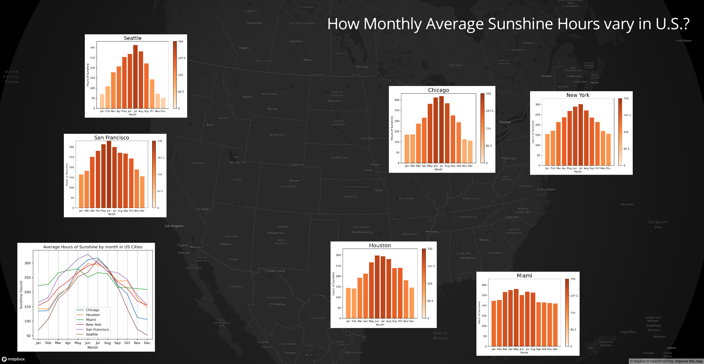

## How the sunshine hours varies in the year across continental United States

This is a project to provide a static visualization of the sunshine hours in the year by month across continental United States. We would like to ask "How Monthly Average Sunshine Hours vary in U.S.?" We selected six representative cities: New York, Chicago, San Francisco, Miami and Seattle, roughly covering the edges of the continental United States. This project is created with Mapbox GL JS. Mapbox GL JS is a JavaScript library that uses WebGL to render interactive maps from vector tiles and Mapbox styles. This visualization is static, but we hope we can make it interactive in the future with Mapbox GL JS.

## Design of the visualization

We decided to use bar plot to visualize the sunshine hours of each city and we overlay these plots on the map of continental United States next to the city. The bar plot provides a straightfoward view of the sunshine hours and its change over the year.Sunshine hours is quantitative and bar plot leverages position encoding, which is believed to be most effective in communicating quantitative values. Overlaying the plot on the map can help audience quickly build a spatial sense of the information. We also leverage saturation encoding to imply the length of sunshine. The more red the bar is, the more sunshine in the month. The same cmap scheme is used for all six bar plots, and the highest monthly sunshine hour is recorded in San Francisco of 330 hours. In weather communication, people tend to associate red with sunshine and blue with percipitation. To summarize, both position and hue are used to make the sunshine hours in each city more expressive. We also would like to recommend a website named [colorbrewer2.org](http://colorbrewer2.org/) to help people choose color schemes for their visualization.

To better compare the sunshine hours between different cities, we draw a line plot and place it on the bottom right corner of the map. This time the cities are nominal varaibles and we do not use saturation as it will be misleading in this case. We use different colors to indicate different cities. And we add grid lines to help audience locate the month and compare the sunshine hours between different cities.

